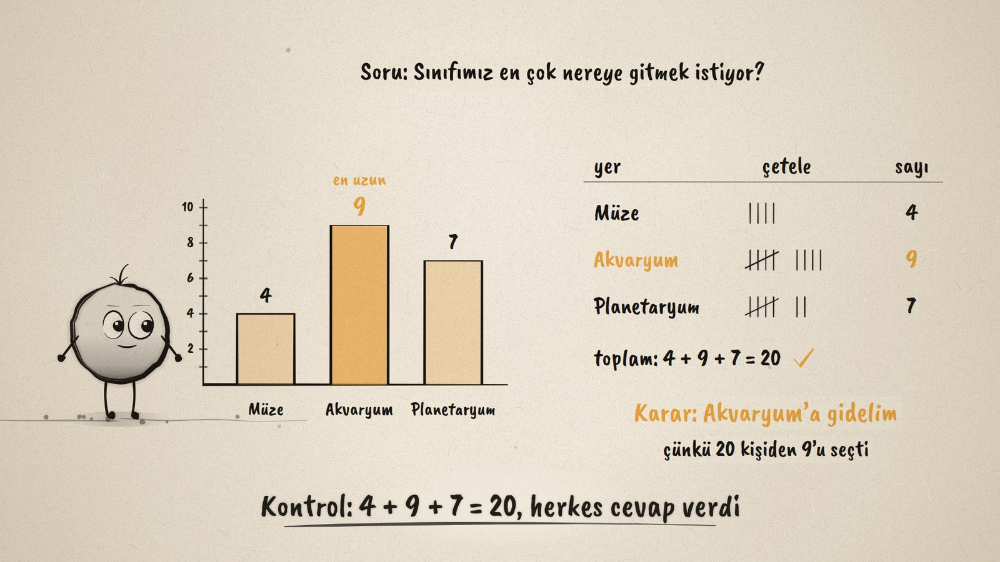
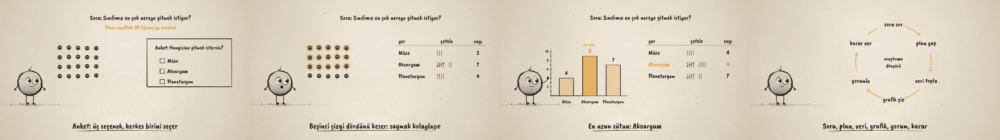

# Veri Ne Diyor? · What Does the Data Say?

**▶ Tarayıcıda izleyin / Watch in the browser:** https://hakanatas.github.io/veri-ne-diyor/ 
**⬇ MP4 + altyazılar / MP4 + subtitles:** [Releases](https://github.com/hakanatas/veri-ne-diyor/releases) 
**✎ Kullanılan istem / The prompt behind it:** [PROMPT.md](PROMPT.md) 
**🎞 Bütün filmler / All films:** [Nokta'nın Filmleri](https://hakanatas.github.io/nokta-filmleri/)

> **TR —** 5. sınıf matematik "İstatistiksel Araştırma Süreci" temasındaki MAT.5.5.1 öğrenme çıktısı için hazırlanmış, tamamen JavaScript ile çizilen 92 saniyelik mürekkep animasyonu. Nokta'nın sınıfı geziye gidecek ama nereye? Önce bir araştırma sorusu yazılıyor (Sınıfımız en çok nereye gitmek istiyor?), plan yapılıyor (20 öğrencinin hepsine soralım) ve üç seçenekli bir anket hazırlanıyor. 20 oy tek tek çetele tablosuna düşüyor; beşinci çizgi dördünü kesiyor. Veri sütun grafiğine dönüşüyor: Müze 4, Akvaryum 9, Planetaryum 7. En uzun sütuna bakılarak gerekçeli bir karar veriliyor (Akvaryum'a gidelim, çünkü 20 kişiden 9'u seçti) ve 4 + 9 + 7 = 20 ile herkesin cevap verdiği kontrol ediliyor. Film araştırma döngüsüyle bitiyor: soru sor · plan yap · veri topla · grafik çiz · yorumla · karar ver. Altyazılar Türkçe, İngilizce ya da ikisi birlikte seçilebilir.

A 92-second ink animation for **5th-grade maths**, drawn entirely with JavaScript on an HTML5 canvas. It is the first film of the *İstatistiksel Araştırma Süreci* theme, after the *Geometrik Şekiller* and *Geometrik Nicelikler* films. Nokta, the ink character from [The Learning Ink](https://github.com/hakanatas/the-learning-ink), is the guide again.

## Learning outcome

MEB, Türkiye Yüzyılı Maarif Modeli, Ortaokul Matematik, 5th grade, "İstatistiksel Araştırma Süreci" theme:

**MAT.5.5.1. Kategorik veri ile çalışabilme ve veriye dayalı karar verebilme**
- a) Kategorik veriye dayanan istatistiksel araştırma gerektiren durumları fark eder.
- b) Kategorik veriye dayanan betimleme veya karşılaştırma gerektirebilecek araştırma soruları oluşturur.
- c) Kategorik veriye ulaşmak için plan yapar.
- ç) Araştırma sorusuna uygun hazırlanan anket sorularını kullanarak veri toplar veya hazır veriye ulaşır.
- d) Veri görselleştirme aracını seçme gerekçelerini belirtir.
- e) Toplanan veriyi uygun araçlar ile analiz eder.
- f) Araştırmada ulaştığı sonuçlara yönelik gerekçeler sunar.
- g) Araştırma sonuçlarının araştırma sorusuna ne düzeyde cevap verdiğini değerlendirerek uygun olmayan adımları yeniden planlar.

## Scenes

| # | Time | Scene | What happens | Outcome |
|---|---|---|---|---|
| 1 | 0–10 s | Gezi nereye? | Where should the class trip go? A situation that needs data. | a |
| 2 | 10–24 s | Soru ve plan | Research question: "Sınıfımız en çok nereye gitmek istiyor?" Plan: ask all 20 students. A survey with three choices. | b, c |
| 3 | 24–44 s | Veri topla | Each student's vote flies into a tally table; the fifth mark crosses the four. Müze 4, Akvaryum 9, Planetaryum 7. | ç, e |
| 4 | 44–62 s | Grafikle göster | The data becomes a bar graph, because bars make categories easy to compare. The tallest bar: Akvaryum. | d, e |
| 5 | 62–78 s | Karar ver | "Karar: Akvaryum'a gidelim, çünkü 20 kişiden 9'u seçti." Check: 4 + 9 + 7 = 20, everyone answered. | f, g |
| 6 | 78–92 s | Araştırma döngüsü | Ask, plan, collect, graph, interpret, decide. Nokta celebrates. | Wrap-up |

## Running it

- **Preview:** double-click `index.html` (it works offline).
- **MP4:** run `npm install` once, then `npm run export -- --format=horizontal --captions=tr`.
- **Subtitles and narration:** `npm run srt` writes `out/captions_*.srt` and `narration_notes.txt`.
- **Editing:**
  - Caption text, timings and narration notes: `captions.js`
  - Everything on screen is drawn by `LI.world(t)` in `scenes/scene1.js` (questions, students, survey card, tally table, bar graph, decision, cycle); the other scenes only set the camera.
  - The votes (`VOTES`), their timing, tally marks and Nokta's poses: `src/draw/film.js`; layout for 16:9 and 9:16: `src/draw/kd.js`

It uses the same engine as The Learning Ink: `renderFrame(t)` as a pure function of time, seeded randomness, and frame-by-frame export.

## Lisans · License

**TR —** Bu film ve kodu [Creative Commons Atıf-GayriTicari 4.0 Uluslararası (CC BY-NC 4.0)](https://creativecommons.org/licenses/by-nc/4.0/deed.tr) lisansıyla paylaşılır. Ticari olmayan her amaçla (derste, okulda, eğitim materyalinde) kopyalayabilir, paylaşabilir ve değiştirebilirsiniz; ancak **kaynak göstermek zorunludur**: eser sahibinin adı ve bu deponun bağlantısı belirtilmeden kullanılamaz. Ticari kullanım (satış, ücretli ürün ya da yayın) için izin alınmalıdır.

**EN —** This film and its code are licensed under [Creative Commons Attribution-NonCommercial 4.0 International (CC BY-NC 4.0)](https://creativecommons.org/licenses/by-nc/4.0/). You may copy, share and adapt them for non-commercial purposes, but **attribution is required**: they may not be used without crediting the author and linking to this repository. Commercial use requires permission.

Atıf örneği / Required credit: *“Veri Ne Diyor?”, Hakan Ataş, Nokta'nın Filmleri — https://github.com/hakanatas/veri-ne-diyor — CC BY-NC 4.0*
